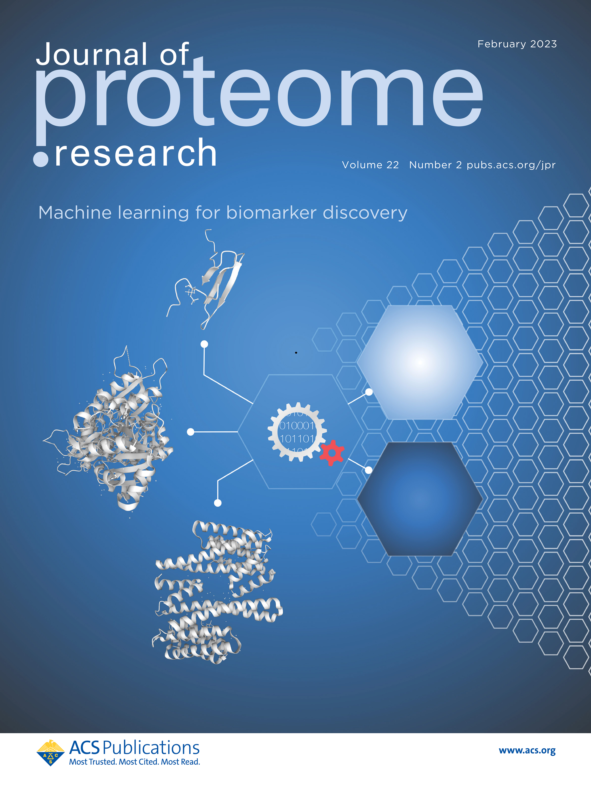

<p align="center">  </p>
<h2 align="center">Online version: <a href="https://ol-v14.streamlit.app/" target="_blank">OmicLearn</a> </h2>

<h2 align="center"> 📰 Documentation: <a href="https://OmicLearn.readthedocs.io/en/latest/" target="_blank">OmicLearn ReadTheDocs </a> </h2>

<div align="center">
  
  
  
  
  
</div>

---

# OmicLearn
Transparent exploration of machine learning for biomarker discovery from proteomics and omics data. 

This is a maintained fork from [OmicEra](https://github.com/OmicEra/OmicLearn).

## Quickstart
A three-minute quickstart video to showcase OmicLearn can be found [here on YouTube](https://youtu.be/VE9pj1G89io).

## PyCon Talk

- ["How to Build an Open-Source Machine Learning Platform in Biology?"](https://2023.pycon.it/en/event/how-to-build-an-open-source-machine-learning-platform-in-biology) | [Furkan M. Torun](https://furkanmtorun.github.io/) | [PyCon Italia, Florence, Italy, 2023](https://2023.pycon.it/en)
  
  [](http://www.youtube.com/watch?v=6RrxWH9qskY "How to Build an Open-Source Machine Learning Platform in Biology? - Furkan M. Torun")


## Manuscript
- 📰 <a href="https://doi.org/10.1021/acs.jproteome.2c00473" target="_blank">Open-access article: **Transparent Exploration of Machine Learning for Biomarker Discovery from Proteomics and Omics Data**</a>

- OmicLearn was featured as a supplementary cover of the [Special Issue on Software Tools and Resources of the Journal of Proteome Research](https://pubs.acs.org/doi/10.1021/acs.jproteome.2c00473)!
 
  

<br>

## Citation:

```
Torun, F. M., Virreira Winter, S., Doll, S., Riese, F. M., Vorobyev, A., Mueller-Reif, J. B., Geyer, P. E., & Strauss, M. T. (2022). 
Transparent Exploration of Machine Learning for Biomarker Discovery from Proteomics and Omics Data.
Journal of Proteome Research. https://doi.org/10.1021/acs.jproteome.2c00473
```

## Online Access

🟢 <a href="https://ol-v14.streamlit.app/" target="_blank">OmicLearn v1.4 | Online Access</a>

This is an online version hosted by streamlit using free cloud resources, which might have limited performance. Use the local installation to run OmicLearn on your own hardware.

## Local Installation

### One-click Installation

You can use the one-click installer to install OmicLearn as an application locally.
Click on one of the links below to download the latest release for:

- [**Windows**](https://github.com/MannLabs/OmicLearn/releases/latest/download/omiclearn_gui_installer_windows.exe)
- [**macOS**](https://github.com/MannLabs/OmicLearn/releases/latest/download/omiclearn_gui_installer_macos.pkg) 
- [**Linux**](https://github.com/MannLabs/OmicLearn/releases/latest/download/omiclearn_gui_installer_linux.deb)

For detailed installation instructions of the one-click installers refer to the [documentation](https://OmicLearn.readthedocs.io/en/latest/ONE_CLICK.html).

### Python Installation

- It is strongly recommended to install OmicLearn in its own environment using [Anaconda](https://docs.conda.io/projects/conda/en/latest/user-guide/install/) or [Miniconda](https://docs.conda.io/en/latest/miniconda.html).

  1. Redirect to the folder of choice and clone the repository: 
    ```bash
    git clone https://github.com/MannLabs/OmicLearn
    ```
    
  2. Create a new environment for OmicLearn: 
    ```bash
    conda create --name OmicLearn python=3.10 -y
    ```
  3. Activate the environment:
    ```bash
    conda activate OmicLearn
    ```
  4. Change to the OmicLearn directory and install OmicLearn:
    ```bash
    cd OmicLearn
    pip install .
    ```

- After a successful installation, type the following command to run OmicLearn:

  ```bash
  python -m omiclearn
  ```

 - After starting the Streamlit server, the OmicLearn page should be automatically opened in your browser Default link: [`http://localhost:8501`](http://localhost:8501)


## Getting Started with OmicLearn

The following image displays the main steps of OmicLearn:


Detailed instructions on how to get started with OmicLearn can be found **[here.](https://OmicLearn.readthedocs.io/en/latest/USING.html)**

## Contributing

All contributions are welcome. 👍

📰 To get started, please check out our **[`CONTRIBUTING`](https://github.com/MannLabs/OmicLearn/blob/master/CONTRIBUTING.md)** guidelines.

When contributing to **OmicLearn**, please **[open a new issue](https://github.com/MannLabs/OmicLearn/issues/new/choose)** to report the bug or discuss the changes you plan before sending a PR (pull request).

We appreciate community contributions to the repository.
